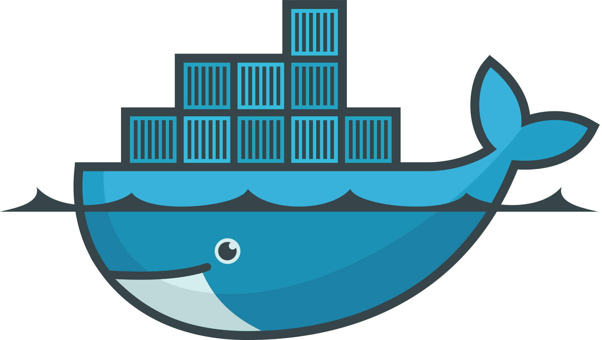
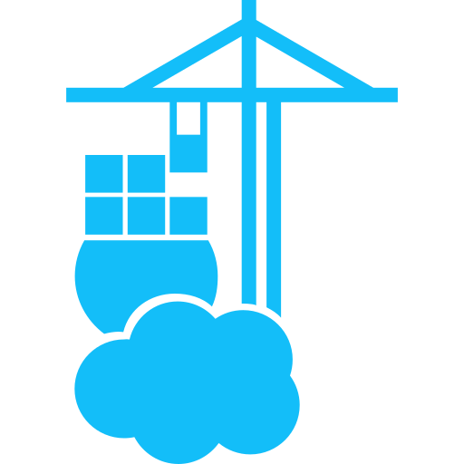

# simple-homelab

Terraform/OpenTofu-managed infrastructure for the user's Proxmox homelab.

> [!NOTE]
> Version numbers are not tracked in this README. For docker-apps services, check the running
> container directly (Watchtower updates them without committing changes here). For everything
> else, check the pinned version in that module's `main.tf`/`project.auto.tfvars`.

## Modules

<!-- generated:modules-table:start -->
| | Module | Purpose |
|---|---|---|
|  | [Host Setup](modules/host/README.md) | This module and its sub-modules setup the Proxmox host. |
|  | [OPNsense VM](modules/opnsense/README.md) | Creates the OPNsense router/firewall VM. WAN attaches untagged to `var.wan_bridge` (gets its address from upstream, e.g. via DHCP during the test phase). LAN attaches untagged/trunk to `var.lan_bridge` - OPNsense itself defines VLAN sub-interfaces on top of that one interface. |
|  | [Samba Setup](modules/samba/README.md) | This module sets up Samba server in an Alpine LXC container using the provided information. |
|  | [Step-CA Setup](modules/step-ca/README.md) | This module sets up Step-CA in an Alpine LXC container using the provided information. |
|  | [Pi-hole Setup](modules/pihole/README.md) | This module sets up Pi-hole in a Debian LXC container using the provided information. |
|  | [PBS LXC Setup](modules/pbs-lxc/README.md) | This module sets up Proxmox Backup Server in a Debian LXC container, using /mnt/backup/pbs (bind-mounted from the host) as the datastore location. Replaces modules/pbs-vm as the deployed PBS instance -- that module is kept in the repo as a fallback option, but no longer applied. Reuses that VM's former IP/MAC so sanctum-pbs.my.world keeps working unchanged. |
|  | [Docker VM Setup](modules/docker-vm/README.md) | This module sets up a [Flatcar Linux VM](https://www.flatcar.org/) with Docker. |
|  | [Backup Jobs](modules/backup-jobs/README.md) | Registers Proxmox Backup Server as a PVE storage target, creates one dedicated backup job per guest (VM/LXC primary disks), and one host-level folder backup per entry in var.folders (real data the guest-level jobs never touch - bind-mounted LXC state, the family file shares, PVE's own recovery-relevant config). |
<!-- generated:modules-table:end -->

### Docker Apps

Deploying a docker-apps service is two steps: `tofu apply` in the module's own directory, then
`docker compose -f docker-compose.yml --env-file stack.env up -d` on the Docker VM.

<!-- generated:docker-apps-table:start -->
| | Module | Purpose |
|---|---|---|
|  | [External (Docker) resources](modules/docker-apps/modules/external-resources/README.md) | This module creates resources, that are not supposed to be part of a `docker-compose.yml`. |
|  | [Traefik dashboard OIDC](modules/docker-apps/modules/traefik/README.md) | This module uses the [OIDC module](../../../common/modules/oidc/README.md) to create the necessary `client_id` to set up OIDC/OAuth for Traefik (dashboard) with Zitadel. |
|   | [Zitadel](modules/docker-apps/modules/zitadel/README.md) | Identity and access management (SSO/OIDC) used by every other docker-apps service |
|  | [Portainer OIDC](modules/docker-apps/modules/portainer/README.md) | This module uses the [OIDC module](../../../common/modules/oidc/README.md) to create the necessary `client_id` and `client_secret` to set up OIDC/OAuth in Portainer with Zitadel. |
|   | [Gitea OIDC](modules/docker-apps/modules/gitea/README.md) | Creates the necessary Zitadel resources (project, OIDC app, roles, user grants) for Gitea to authenticate via Zitadel SSO. |
|    | [Grafana Alloy and Prometheus OIDC](modules/docker-apps/modules/monitoring/README.md) | This module uses the [OIDC module](../../../common/modules/oidc/README.md) to create the necessary `client_id` to set up OIDC/OAuth for Grafana Alloy and Prometheus with Zitadel. |
|  | [Grafana OIDC](modules/docker-apps/modules/grafana/README.md) | This module uses the [OIDC module](../../../common/modules/oidc/README.md) to create the necessary `client_id` to set up OIDC/OAuth in Grafana with Zitadel. |
|    | [Outline OIDC](modules/docker-apps/modules/outline/README.md) | This module uses the [OIDC module](../../../common/modules/oidc/README.md) to create the necessary `client_id` and `client_secret` to set up OIDC/OAuth in Outline with Zitadel. |
|  | [Jellyfin Web UI OIDC](modules/docker-apps/modules/jellyfin/README.md) | This module uses the [OIDC module](../../../common/modules/oidc/README.md) to create the necessary `client_id` to set up OIDC/OAuth for Jellyfin (dashboard) with Zitadel. |
|    | [Grist OIDC](modules/docker-apps/modules/grist/README.md) | This module uses the [OIDC module](../../../common/modules/oidc/README.md) to create the necessary `client_id` and `client_secret` to set up OIDC/OAuth in Grist with Zitadel. |
|  | [Watchtower](modules/docker-apps/modules/watchtower/README.md) | Automatically restarts containers when a newer image is pushed |
<!-- generated:docker-apps-table:end -->

### Other modules

<!-- generated:appendix-table:start -->
| | Module | Purpose |
|---|---|---|
|  | [common](modules/common/README.md) |  |
|  | [PBS VM Setup](modules/pbs-vm/README.md) | This module sets up a Debian VM running Proxmox Backup Server. |
<!-- generated:appendix-table:end -->
