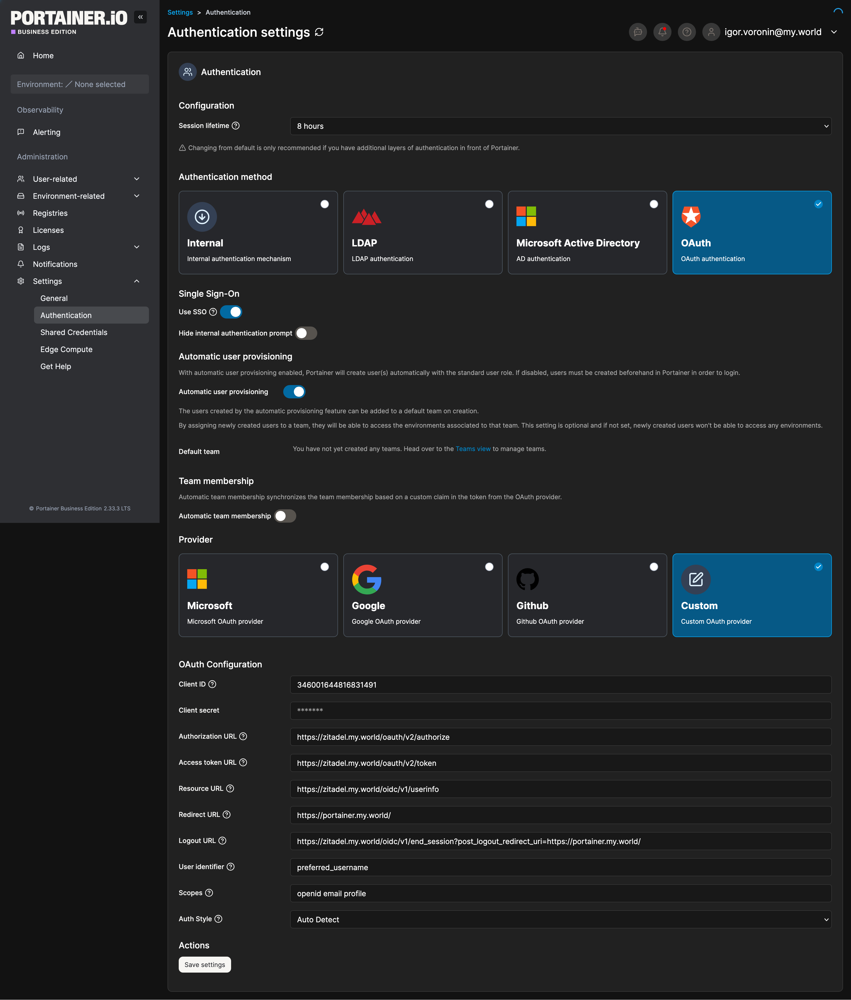

# Additional instructions

These additional instructions assume you set up the [Flatcar Linux Docker VM](../docker-vm/README.md) (https://www.flatcar.org/).

## Preparing the Docker environment

When installing docker applications, set up the <ins>**networks**</ins> and <ins>**volumes**</ins>, that are **not specific to any single Stack** (`docker-compose.yml` file), using the Terraform script (`main.tf`).

### Docker context
The command is simple, but requires you to configure a proper Docker [context](https://docs.docker.com/engine/manage-resources/contexts/) to your Docker VM and providing proper SSL client certificates.

Docker context related commands:
```bash
# List current docker contexts
$ docker context ls 

# Create a new context; replace <absolute-path-to> with proper absolute path
$ docker context create <context-name> --docker "host=tcp://<ip>:2396,ca=/<absolute-path-to>/ca.pem,cert=<absolute-path-to>/cert.pem,key=<absolute-path-to>/key.pem"

# Inspect a particular context
$ docker context inspect <context-name>

# Update a context
$ docker context update <context-name> --docker "..." # repeat all parameters
```

### Step CA client-side certificates
In order to successfully connect to the remote Docker instance in the Docker VM, a valid client certificate is required.

The following script describes how to acquire the certificates.
> [!NOTE]
> The reason the shell script is this insecure, is, that I wanted to run it as a LaunchDemon (rather than a user-specific LaunchAgent), because the latter would not allow `step` to access the Local Network. The former however does not have proper access to the MacOS Keychain.
> **Do better if you can!**

<details>
<summary><code>renew-certs.sh</code> script</summary>

```bash
#!/bin/bash

CERT_PATH="cert.pem"        # add absolute path if desired
KEY_PATH="key.pem"          # add absolute path if desired
HOSTNAME=$(hostname)
USER=$(whoami)
TEST_PING_IP=192.168.1.20   # your Step CA IP

# Wait for network to be available (max 60 seconds)
echo "Checking network connectivity..."
for i in {1..12}; do
    if ping -c 1 -W 1 "$TEST_PING_IP" &>/dev/null; then
        echo "Network is available"
        break
    fi
    if [ $i -eq 12 ]; then
        echo "ERROR: Network not available after 60 seconds"
        exit 1
    fi
    echo "Waiting for network... (attempt $i/12)"
    sleep 5
done

# Renew the certificate
# Note: replace `./step-password-file` accordingly or use more secure means.
step ca certificate "${USER}@${HOSTNAME}" \
    "$CERT_PATH" \
    "$KEY_PATH" \
    --provisioner "admin@my.world" \
    --password-file "./step-password-file" \
    --root "/Users/igvo/.step/certs/root_ca.crt" \
    --not-after=16h \
    --force

if [ $? -eq 0 ]; then
    echo "Certificate renewed successfully at $(date)"
else
    echo "ERROR: Certificate renewal failed at $(date)"
    exit 1
fi

chown igvo:staff "$CERT_PATH"
chown igvo:staff "$KEY_PATH"
```
</details>

### Consequences of exposing Docker securely via TLS

In the `docker-compose.yml` the following volume is mounted: `- /var/run:/var/run/:ro` **instead** of mounting just the `docker.sock` directly, because unfortunately when restarting the Docker (systemd) service in the Flatcar Linux Docker VM, the file is deleted and created anew rather than updated, possibly occupying a different [inode](https://en.wikipedia.org/wiki/Inode). Therefore the container (e.g. Traefik or Portainer) loses its bind mount to the Docker host and is not able to function properly anymore.

Mounting `/var/run` does not result in the same issue and the Docker host connection is picked up correctly every time.

The **reason** Docker (systemd) service is restarted frequently is, that it's exposed via Docker TLS (port 2396) and the certificates are auto-updated every 12-24 hours.

## Installing Portainer `docker-compose.yml`

You will be installing Portainer in an insecure mode first. It will be available using `http://<host-vm-ip>:9000`.

From the `portainer` directory, run the following to install Portainer.
```bash
$ docker compose -f ./docker-compose.yml --env-file ./stack.env up -d
```

Use e.g. `docker ps` to check if the container is running properly.

> [!TIP]
> Have your license ready and ideas for a proper name of the Portainer administrator and his password beforehand, because for security reasons the Portainer container will have to be restarted if the initial set up times out.

We will not be using Portainer for everything - it is just a much more sophisticated monitoring tool.

## Installing Traefik `docker-compose.yml`

You will be installing Traefik without a proper dashboard, because the dashboard is behind an OIDC forward-auth proxy (`traefik-oidc-auth`), which requires Zitadel (or any other OAuth SSO application) to be installed and configured.

> [!NOTE]
> Should you need to access the Traefik dashboard before you install Zitadel, just **remove** the `oidc-traefik-dashboard@docker` middleware for the time being and re-deploy Traefik.

> [!WARNING]
> If you are following this guide, you probably could not restore any backups. If so, create the `/mnt/data/traefik` directory (with `sudo`) **in the Flatcar Linux Docker VM** and assign it to the user:group `1000:1000` by running `sudo chmod -R 1000:1000 /mnt/data/traefik`. This directory will store **the `acme.json`** file.

From the `traefik` directory (on your client), run the following to install Traefik.
```bash
$ docker compose -f ./docker-compose.yml --env-file ./stack.env up -d
```

Assuming Step CA LXC is available and properly set up, Traefik should start up.

> [!NOTE]
> Don't worry about `ZITADEL_APPLICATION_CLIENT_ID` - this value is not yet known and while it **does prevent** you from accessing the Traefik dashboard (see previous note), it does not hinder the installation of Traefik.

> [!TIP]
> Use `traefik-oidc-auth` for Forward-Auth OIDC authentication for applications such as the Traefik v3 dashboard. Use proper OAuth2 / OIDC login for applications, that support it.

## Installing Zitadel `docker-compose.yml`

Now that Traefik is installed, you have to install Zitadel, which will be the SSO provider for the homelab.

> [!WARNING]
> If you are following this guide, you probably could not restore any backups. If so, create the `/mnt/data/zitadel` directory (with `sudo`) **in the Flatcar Linux Docker VM** and assign it to the user:group `1000:1000` by running `sudo chmod -R 1000:1000 /mnt/data/zitadel`. This directory will store **multiple Zitadel files**, including the `masterkey`.

> [!WARNING]
> Ensure, that `/mnt/data/zitadel/masterkey` **exists** and either belongs to the user `1000:1000` and has very limited permissions or belongs to the user `root:root` and has more permissive permissions (e.g. `755`). **The file also <ins>must</ins> be `32` bytes long**.

From the `zitadel` directory, run the following to install Zitadel.
```bash
$ docker compose -f ./docker-compose.yml --env-file ./stack.env up -d
```

The containers should have come up and `https://zitadel.my.world` should now be accessible. **Copy** the `/mnt/data/zitadel/admin_key.json` file *from* the Flatcar Linux Docker VM *to* the `docker-apps` directory. You will need it to be able to use Terraform to create projects and applications in Zitadel and assign your admin user to it.

> [!WARNING]
> You might want to have a dedicated PostgreSQL database for security reasons **just** for Zitadel. You can even have a separate network, that connects these two containers and isn't accessible otherwise. Or you could configure PostgreSQL to only accept connections from particular hosts. **Do not forget to use strong passwords.**

## Create projects and applications in Zitadel, grant projects to a user

Now that you have Traefik and Zitadel running, you can revisit the `traefik` and `portainer` folders and run:
```bash
$ tofu init
$ tofu apply -show-sensitive
```

This will generate `client_id` (and `client_secret` if applicable) for the respective projects.

### Adding OAuth to Traefik

Change the value of `ZITADEL_APPLICATION_CLIENT_ID` in `traefik/stack.env` to the `client_id` you received from the Terraform script (use `tofu output -raw client_id` if you don't see the property anymore). Then redeploy the `docker-compose.yml` the same way you initially deployed it. `https://traefik.my.world` now should ask you to login (if you are not yet logged in already) and upon successfully logging in redirect you to the Traefik dashboard as expected.

### Adding OAuth to Portainer

Adding OAuth to Portainer is a little bit more engaging.
1. Log in into Portainer using your Portainer-internal admin account.
2. Go to Settings > Authentication.

3. Pick "OAuth" as your authentication method.
4. Enable "Automatic user provisioning" (or create the correct user ahead of time).
5. Select "Custom" as the provider.
6. Configure the provider like so:
    | Field | Value |
    |-------|-------|
    | **Client ID** | `3460016441883141` |
    | **Client secret** | `*******` |
    | **Authorization URL** | `https://ztadel.my.world/oauth/v2/authorize` |
    | **Access token URL** | `https://ztadel.my.world/oauth/v2/token` |
    | **Resource URL** | `https://ztadel.my.world/oidc/v1/userinfo` |
    | **Redirect URL** | `https://portainer.my.world/` |
    | **Logout URL** | `https://ztadel.my.world/oidc/v1/end_session?post_logout_redirect_url=https://portainer.my.world/` |
    | **User identifier** | `preferred_username` |
    | **Scopes** | `openid email profile` |
    | **Auth Style** | `Auto Detect` |
    > [!NOTE]
    > Make sure to use the `client_id` and `client_secret` from the Terraform script (use `tofu output -raw client_id` and `tofu output -raw client_secret` if you don't see the properties anymore).
7. Save the configuration.
8. Open a private or inkognito tab in your browser.
9. Navigate to `https://portainer.my.world`
10. Use "Login with OAuth" to login.

If the login was successful, everything worked. If not, investagete on what might be causing it (note e.g., that `scopes` are space-separated, **not** comma-separated, and that you have to use `preferred_user` as your `User identifier`).

## Pitfalls

1. Upon first setup it might be necessary to create particular folders - e.g. `/mnt/data/traefik/acme` **inside the Docker VM**.
2. First-time ACME requests from Traefik to Step CA seem to take 5+ minutes. It's hard to tell exactly why (perhaps, because Traefik does not recognize / acknowledge the Step CA URL even though all containers, the Docker VM, the host **and** Step CA itself trust Step CA's root certificate).
> [!TIP]
> Be patient and perhaps restart the Traefik container. After some time it should successfully receive the desired certificates.
3. Ensure if possible, that the host, Step CA, the Docker VM and all containers use your local / set time (whether it's UTC or GMT+x does not matter). This will significantly ease the burden of tracing logs and keeping up with SSL certificate updates, as they're short-lived (24h1m) by default.
